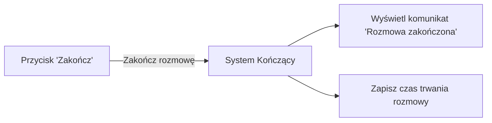

# Kodziaki i Komunikator

kodziaki i zabawy w kodowanie

1. Wybieranie nazwy użytkownika
   - **Interfejs wyjścia:** Ekranik na urządzeniu, na którym pokazuje się miejsce do wpisania wybranej nazwy użytkownika.
   - **Interfejs wejścia:** Klawiatura (fizyczna lub ekranowa), za pomocą której wpisujesz swoją wymarzoną nazwę.
   - **Logika:** Program w urządzeniu sprawdza, czy wymyślona nazwa nie jest już używana przez kogoś innego i czy nie zawiera brzydkich słów.
   - **Dane:** Nazwa użytkownika, którą wpisałeś, jest zapisywana, abyś mógł jej używać, kiedy zechcesz się zalogować.

2. Nawiązywanie połączenia, w którym użytkownik nie odpowiada
   - **Interfejs wyjścia:** Ekranik lub głośnik, który informuje o dzwonieniu do drugiej osoby.
   - **Interfejs wejścia:** Przycisk "Zadzwoń" lub podobny, który naciskasz, aby rozpocząć połączenie.
   - **Logika:** Program próbuje skontaktować się z drugą osobą, sygnalizując dzwonek po jej stronie, ale nie otrzymuje odpowiedzi.
   - **Dane:** Informacja o nieodebranym połączeniu jest zapisywana, aby można było później zobaczyć, kto próbował zadzwonić.

3. Nawiązywanie połączenia
   - **Interfejs wyjścia:** Głośnik telefonu czy komputera, przez który słychać głos drugiej osoby.
   - **Interfejs wejścia:** Przycisk "Zadzwoń" lub podobny, który znów naciskasz, aby zacząć rozmowę, oraz mikrofon, do którego mówisz.
   - **Logika:** Program na urządzeniu łączy cię z drugą osobą i przekazuje wasze głosy między sobą.
   - **Dane:** Informacje o połączeniu, jak długość rozmowy i z kim była przeprowadzona, są zapisywane dla ewentualnych potrzeb np. rozliczeń.

4. Zakończenie komunikacji głosowej
   - **Interfejs wyjścia:** Ekran pokazujący, że rozmowa się zakończyła, ewentualnie krótki sygnał dźwiękowy.
   - **Interfejs wejścia:** Przycisk "Zakończ" lub czerwona słuchawka, które naciskasz, kiedy chcesz zakończyć rozmowę.
   - **Logika:** Program na urządzeniu przerywa połączenie z drugą osobą, kiedy ty tego chcesz.
   - **Dane:** Informacja o zakończeniu rozmowy i jej długości zostają zapisane, abyś mógł wiedzieć, ile czasu spędziłeś na rozmowie.

